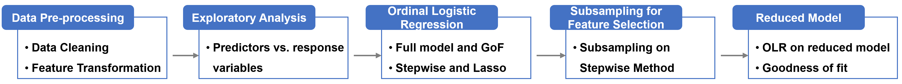

## 1. Introduction

Subjective happiness is important for human beings. Our project focus on explore how political attitude and behavior influence subjective happiness based on the data set of European Social Survey. As the response variable is ordinal variable, we apply Ordinal Logistic Regression in our research. Modeling upon the whole data set (~42k observations), we get a full model in which almost all variables are statistically significant. Considering that the size of the data set is large, the coefficients are more likely to be statistically significant. Thus, we apply subsampling method, which generates small samples for many times and fits model on each small sub-sample, to do variable selection and to check the significance of different explanatory variables in order to achieve more robust results. Based on the results from subsampling, we find that individual’s confidence in own ability to participate in politics, general satisfaction on social environment and the degree of political behavior involvement have positive effect on happiness, while participants’ general trust to political entities has negative effect on their subjective happiness.

## 2. Implementation of Subsampling

Applying subsampling method, we generated a random sample with smaller size from the original dataset. Upon the sub-sample set, we ran Ordinal Logistic Regression to get p-value of the hypothesis testing on each coefficient and confidence interval of each coefficient. We repeated the subsampling process for 100 times.  

- First, we compared the distribution of 100 p-values corresponding to the same predictor against the Uniform distribution. If the distribution of p-values doesn't follow a Uniform distribution, it's more likely that the effect of the predictor is significant.  

- Then, we also calculated the average confidence interval for each coefficient to check whether zero is included in.  

- Besides, we used each sub-sample to run stepwise Ordinal Logistic Regression and counted how many times each variable was selected among 100 sub-samples.  

According to all the three aspects of evidence, we found that,  

- **Ability to Participate (“cptppolaa”)**: individual’s confidence in own ability to participate in politics have significant influence on happiness. Compared to baseline (not at all confident), other groups have higher level of happiness. And the higher the confidence, the happier the person will be.  

- **General Trust to Political Entities (“generaltrust”)**: general trust has a negative coefficient, which indicates that for the individuals who trust the political entities more, they are relatively not happy.  

- **General Satisfaction on Social Environment (“generalsatisfaction”)**: general satisfaction has a positive coefficient, which indicates that if a person is more satisfied with the social environment, he will also be happier.  

- **Political Behavior Involvement (“behaviorinvolvment”)**: compared to baseline (not at all), the coefficients of other groups are positive, which means some degree of involvement will increase subjective happiness.  

## 3. Project Setup

- [Dataset](https://www.kaggle.com/pascalbliem/european-social-survey-ess-8-ed21-201617?select=ESS8e02.1_F1.csv)
